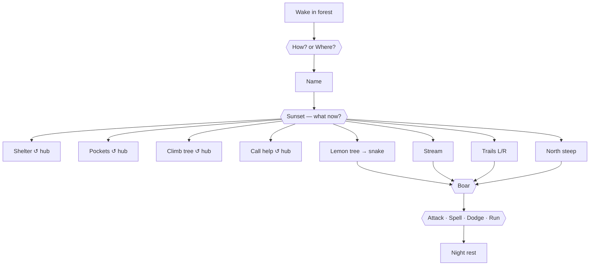
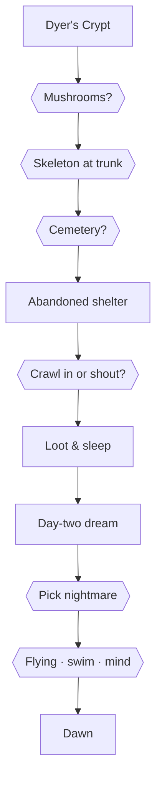
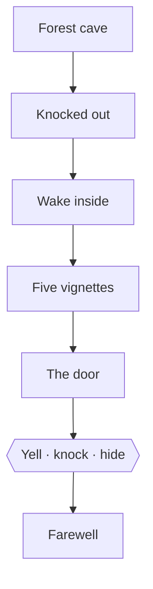
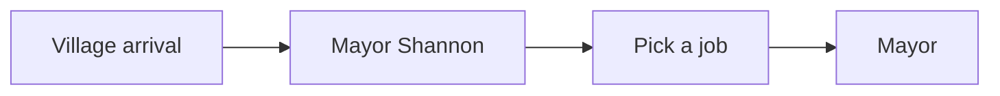

# Quest pictogram (wired spine)

One compact diagram **per day**, top to bottom. Forks are diamonds; ↺ hub = return to sunset choices.
Step-level copy lives in quest files and `MAIN_QUEST.md`.

Regenerate: `npx vite-node scripts/generate-quest-trees.mjs --out docs/design/QUEST_TREES.md`

---

## Spine

```
Day 1: 001 Origin → 002 Sunset
Day 2: 003 Dyer's Crypt → 004 Shelter → 007 Dream
Day 3: 005 Forest Cave → 004b The Door
Village: 036 → 042 → 040 → 041
```

## Day 1

*001 Origin → 002 Sunset*



## Day 2

*003 Dyer's Crypt → 004 Shelter → 007 Dream*



## Day 3

*005 Forest Cave → 004b The Door*



## Village

*036 → 042 → 040 → 041*


